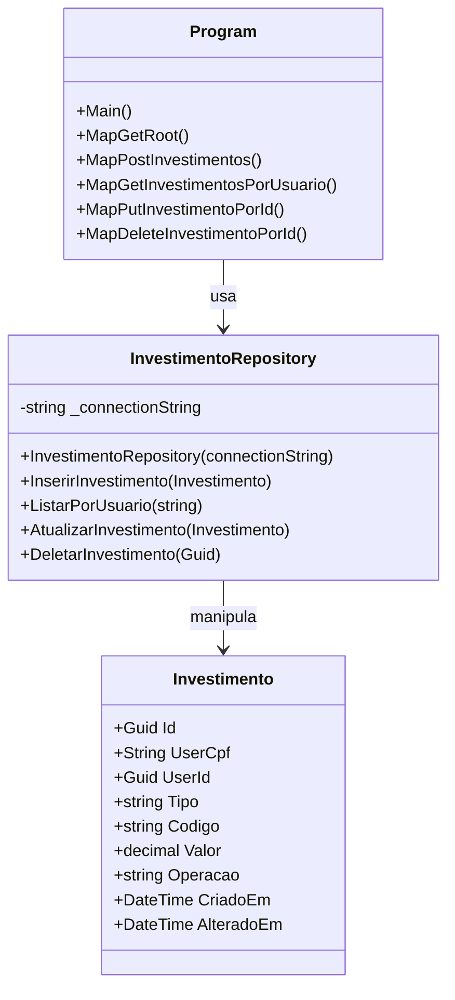

# Investimentos

Este projeto faz parte do Sprint 3 da disciplina de C#.

## Descrição

O projeto `Investimentos` é uma aplicação desenvolvida em C# que tem como objetivo gerenciar diferentes tipos de investimentos. Ele utiliza uma arquitetura baseada em repositórios e modelos, facilitando a manutenção e a escalabilidade do código.

## Estrutura do Projeto

- **Program.cs**: Ponto de entrada da aplicação.
- **Models/Investimento.cs**: Define a estrutura dos investimentos.
- **Repositories/InvestimentoRepository.cs**: Responsável pelo acesso e manipulação dos dados dos investimentos.
- **appsettings.json / appsettings.Development.json**: Configurações da aplicação.
- **wwwroot/**: Arquivos estáticos (HTML, SVG, etc).

## Como Executar

1. Certifique-se de ter o .NET 9.0 SDK instalado.
2. No terminal, navegue até a pasta `Investimentos`.
3. Execute o comando:
   ```powershell
   dotnet run
   ```
4. Acesse a aplicação conforme instruções do terminal.

## Dependências

- .NET 9.0
- Npgsql (para acesso a banco de dados PostgreSQL)

## Observações


## Autor

André Lambert – RM 99148
Felipe Cortez - RM 99750
Julia Lins - RM 98690
Luis Barreto - RM 99210
Victor Aranda - RM 99667

## Testes e Dados de Exemplo

Para testar a aplicação, utilize o CPF de exemplo abaixo ao cadastrar ou consultar investimentos:

**CPF para testes:** `526.049.282-38`

Esse CPF já está presente na base de dados de exemplo e pode ser usado para validar as funcionalidades de cadastro, consulta, atualização e remoção de investimentos.

## Arquitetura

O projeto segue o padrão de arquitetura em camadas, separando responsabilidades em:
- **Modelos:** Representação dos dados (pasta Models)
- **Repositórios:** Acesso e manipulação dos dados (pasta Repositories)
- **Program.cs:** Configuração dos endpoints e inicialização da aplicação

### Diagrama das Classes



## Documentação

Todas as principais funcionalidades estão documentadas nos comentários do código e neste README. Para dúvidas, consulte os arquivos fonte ou entre em contato com o autor.

## Endpoints da API

### 1. GET /
Retorna a página inicial da aplicação web (`index.html`), localizada em `wwwroot`.
**Exemplo:**
```http
GET http://localhost:5171/
```

### 2. POST /investimentos
Cadastra um novo investimento para um usuário.
**Exemplo:**
```http
POST http://localhost:5171/investimentos
Content-Type: application/json

{
   "userCpf": "526.049.282-38",
   "tipo": "Ação",
   "codigo": "PETR4",
   "valor": 1000.50,
   "operacao": "Compra"
}
```

### 3. GET /investimentos/{cpf}
Lista todos os investimentos de um usuário pelo CPF.
**Exemplo:**
```http
GET http://localhost:5171/investimentos/526.049.282-38
```
### 6. GET /investimentos/download/{cpf}
Gera e faz o download de um arquivo `.txt` contendo todos os investimentos do usuário informado pelo CPF.
O arquivo inclui os campos: Id, UserCpf, Tipo, Código, Valor, Operação.
**Exemplo:**
```http
GET http://localhost:5171/investimentos/download/526.049.282-38
```
O arquivo será baixado automaticamente pelo navegador ou ferramenta HTTP utilizada.

### 4. PUT /investimentos/{id}
Atualiza os dados de um investimento pelo ID.
**Exemplo:**
```http
PUT http://localhost:5171/investimentos/6e1e2b7a-8c2a-4c1a-9e2a-123456789abc
Content-Type: application/json

{
   "tipo": "Fundo Imobiliário",
   "codigo": "HGLG11",
   "valor": 1500.00,
   "operacao": "Compra"
}
```

### 5. DELETE /investimentos/{id}
Remove um investimento pelo ID.
**Exemplo:**
```http
DELETE http://localhost:5171/investimentos/6e1e2b7a-8c2a-4c1a-9e2a-123456789abc
```

Sprint 3 - C#
